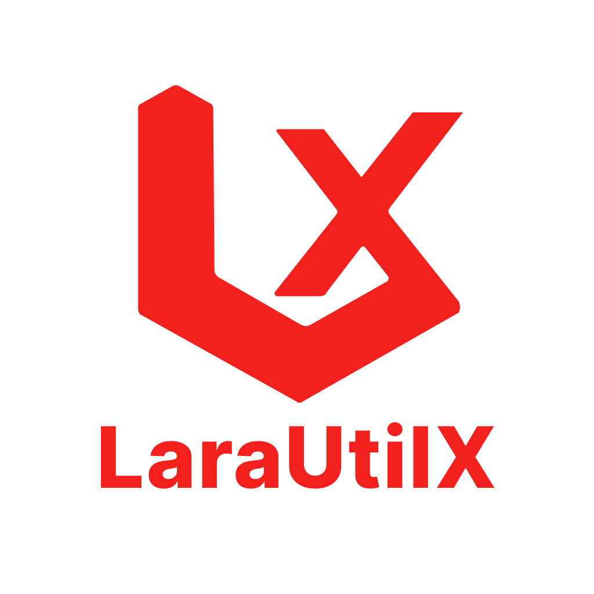

# LaraUtilX: Unleash the Power of Laravel with Utilities and Helpers

<div align="center">
  
</div>

LaraUtilX is a comprehensive Laravel package designed to supercharge your development experience by providing a suite of utility classes, helpful traits, middleware, and more. Whether you're a seasoned Laravel developer or just getting started, LaraUtilX offers a collection of tools to streamline common tasks and enhance the functionality of your Laravel applications.

**Version:** 1.3.0  
**Laravel Support:** Laravel 8.0+  
**PHP Support:** PHP 8.0+  
**License:** MIT

---

📘 **Full Documentation**  
Explore full usage examples, configuration options, and best practices at:  
👉 [https://larautilx.omarchouman.com](https://larautilx.omarchouman.com)

---

## Key Features

1. **CrudController:** Simplify your CRUD operations with the generic `CrudController` that can be easily extended, allowing you to create, read, update, and delete records effortlessly.

2. **ApiResponseTrait:** Craft consistent and standardized API responses with the `ApiResponseTrait`. This trait provides helper methods for formatting JSON responses, making your API endpoints clean and well-structured.

3. **FileProcessingTrait:** Manage file uploads and deletions seamlessly with the `FileProcessingTrait`. This trait offers methods for uploading single or multiple files, deleting files, and now retrieving file contents.

4. **ValidationHelperTrait:** Validate user input with ease using the `ValidationHelperTrait`. This trait includes handy methods for common validation scenarios, such as email addresses, phone numbers, and strong passwords.

5. **SchedulerMonitor:** Keep an eye on your scheduled tasks with the `SchedulerUtil` utility. Monitor upcoming scheduled events, check if tasks are overdue, and gain insights into the status of your scheduled jobs.

6. **FilteringUtil:** Effortlessly filter data based on specified criteria with the `FilteringUtil`. This utility provides a convenient way to filter collections or arrays based on field names, operators, and values.

7. **AccessLogMiddleware:** LaraUtilX includes middleware components like the `AccessLogMiddleware` to log access to your application, adding an extra layer of security and accountability.

8. **PaginationUtil:** Seamlessly handle paginated data with LaraUtilX's `PaginationUtil`. This utility simplifies the process of paginating query results, allowing you to customize the number of items per page, navigate through paginated results effortlessly, and present data in a user-friendly manner.

9. **CachingUtil:** Optimize performance and reduce database queries using LaraUtilX's `CachingUtil`. Store and retrieve frequently accessed data with ease, taking advantage of features like customizable cache expiration and cache tags.
    
10. **ConfigUtil:** Manage your Laravel configuration settings effortlessly with the `ConfigUtil`. Retrieve, set defaults, and dynamically manipulate configuration data. Simplify the way you interact with your application's configuration, ensuring a clean and organized approach.

11. **LLM Providers:** Effortlessly integrate advanced AI-powered chat completions into your Laravel application with our LLM providers. Choose between OpenAI's GPT models or Google's Gemini models through a unified interface. Both providers support all major chat parameters, automatic retry logic, and structured responses. Generate dynamic, context-aware text completions for your users with just a few lines of code.

    - **OpenAIProvider:** Interact with OpenAI's GPT models (GPT-3.5, GPT-4, etc.)
    - **GeminiProvider:** Interact with Google's Gemini models (Gemini 2.0 Flash, etc.)
    - **Configurable Provider Selection:** Switch between providers via configuration
    - **Unified Interface:** Same API for both providers with automatic model selection

12. **FeatureToggleUtil:** Implement feature flags and toggles with ease using the `FeatureToggleUtil`. Enable or disable features dynamically based on configuration, user context, or environment settings. Perfect for A/B testing, gradual rollouts, and feature management.

13. **LoggingUtil:** Enhance your application's logging capabilities with the `LoggingUtil`. Create structured logs with JSON formatting, custom channels, and contextual information. Includes predefined methods for all log levels with automatic timestamp and environment tracking.

14. **QueryParameterUtil:** Parse and validate query parameters from HTTP requests with the `QueryParameterUtil`. Safely extract and filter query parameters based on allowed lists, improving API security and data handling.

15. **RateLimiterUtil:** Implement rate limiting for your APIs and endpoints using the `RateLimiterUtil`. Control request frequency, prevent abuse, and manage API usage with configurable limits and decay times.

16. **Auditable Trait:** Automatically track model changes with the `Auditable` trait. Log create, update, and delete operations with user context, old values, and new values. Perfect for audit trails and compliance requirements.

17. **RejectCommonPasswords Rule:** Strengthen password security with the `RejectCommonPasswords` validation rule. Prevent users from using common, easily guessable passwords with a comprehensive list of weak passwords.

## Test Suite

LaraUtilX comes with a comprehensive test suite that ensures reliability and quality. The test suite includes both unit tests and feature tests covering all utilities, traits, and components.

### Running Tests

#### Prerequisites

Make sure you have installed the development dependencies:

```bash
composer install --dev
```

#### Run All Tests

```bash
./vendor/bin/phpunit
```

#### Run Specific Test Suites

```bash
# Run only unit tests
./vendor/bin/phpunit --testsuite Unit

# Run only feature tests
./vendor/bin/phpunit --testsuite Feature
```

#### Run Specific Test Classes

```bash
# Run tests for a specific utility
./vendor/bin/phpunit tests/Unit/Utilities/CachingUtilTest.php

# Run tests for a specific trait
./vendor/bin/phpunit tests/Unit/Traits/ApiResponseTraitTest.php
```

#### Run Tests with Coverage

```bash
./vendor/bin/phpunit --coverage-html coverage
```

### Test Coverage

The test suite provides comprehensive coverage for:

- **Utilities**: All utility classes with their methods and edge cases
- **Traits**: All traits with their functionality and integration
- **Enums**: All enum values and behaviors
- **Rules**: Validation rules with various input scenarios
- **Feature Tests**: Integration scenarios and performance tests

### Test Structure

```
tests/
├── TestCase.php                    # Base test case with Laravel setup
├── Unit/                          # Unit tests for individual components
│   ├── Enums/
│   │   └── LogLevelTest.php
│   ├── Rules/
│   │   └── RejectCommonPasswordsTest.php
│   ├── Traits/
│   │   ├── ApiResponseTraitTest.php
│   │   └── FileProcessingTraitTest.php
│   └── Utilities/
│       ├── CachingUtilTest.php
│       ├── ConfigUtilTest.php
│       ├── FeatureToggleUtilTest.php
│       ├── FilteringUtilTest.php
│       ├── LoggingUtilTest.php
│       ├── PaginationUtilTest.php
│       ├── QueryParameterUtilTest.php
│       ├── RateLimiterUtilTest.php
│       └── SchedulerUtilTest.php
└── Feature/                       # Integration tests
    ├── Traits/
    │   └── ApiResponseTraitFeatureTest.php
    └── Utilities/
        └── CachingUtilFeatureTest.php
```

## How to Get Started

1. Install LaraUtilX using Composer:
   ```bash
   composer require omarchouman/lara-util-x
   ```
2. Explore the included utilities, traits, and middleware in your Laravel project.
3. Customize and extend LaraUtilX to match the specific needs of your application.

## Development & Contributing

LaraUtilX is actively maintained and welcomes contributions! The package includes a comprehensive test suite to ensure reliability and quality.

### Development Setup

1. Clone the repository
2. Install dependencies: `composer install --dev`
3. Run tests: `./vendor/bin/phpunit`
4. Check code coverage: `./vendor/bin/phpunit --coverage-html coverage`

### Writing Tests

When contributing new features:
- Write unit tests for individual components
- Write feature tests for integration scenarios
- Maintain high test coverage (90%+)
- Follow the AAA pattern: Arrange, Act, Assert
- Test edge cases and error conditions

### Code Quality

- Follow PSR-12 coding standards
- Use descriptive variable and method names
- Include comprehensive docblocks
- Handle errors gracefully
- Write clean, maintainable code

Save time, enhance code readability, and boost your Laravel projects with LaraUtilX – the toolkit every Laravel developer deserves.